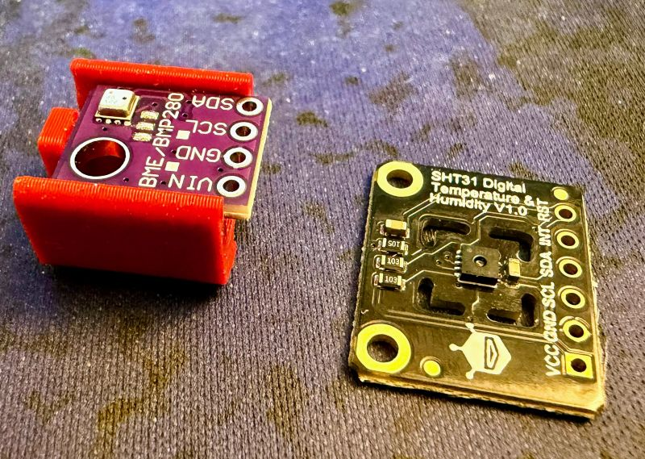
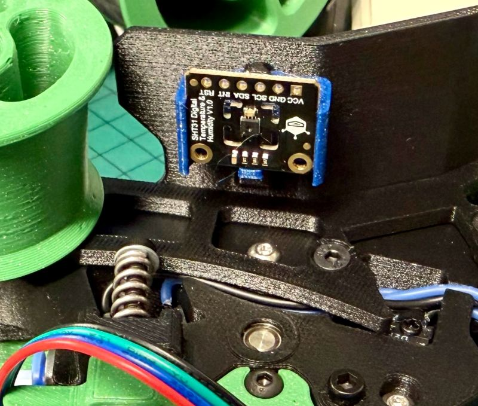
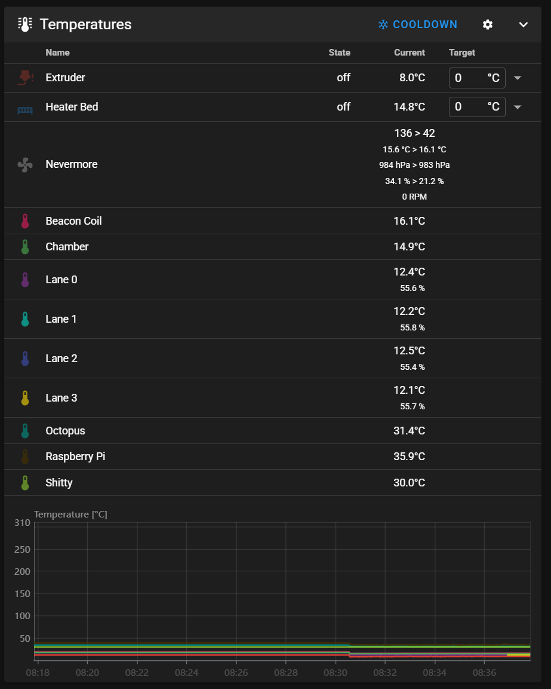

# DFRobot SHT31 Temperature & Humidity Sensor Holder

## Overview
High(er) accuracy temperature & humidity sensor for use in the box instead of the standard BME280.

- Pros
    - ±2%RH at 0%RH to 100%RH (at 25°C）humidity accuracy Vs. ±3%RH 20%RH to 80%RH
    - -40°C to 125°C temperature detection range Vs. -40°C to 85°C range (although if its that hot, you've got bigger problems!)
    - Legit Fermion sensor Vs. potential BME280 clones

- Cons
    - Bigger footprint
    - More expensive (~£7 Vs. £4 per sensor)

## BOM
- DFRobot part no: SEN0331

## Where to get them?

Stick to suppliers with a known supply chain.

#### Worldwide
- [Mouser](https://www.mouser.co.uk/ProductDetail/DFRobot/SEN0331)
- [Digikey](https://www.digikey.co.uk/en/products/detail/dfrobot/SEN0331/12324931)

#### UK
- [ThePiHut](https://thepihut.com/products/fermion-sht31-digital-temperature-humidity-sensor?variant=42046092607683)
- [Farnell](https://uk.farnell.com/dfrobot/sen0331/temp-humidity-sensor-breakout/dp/4308263)

## Print settings
Standard EMU settings (999 walls) with shrinkage factor for your chosen filament.

## Code

By default the SHT3X klipper module expects the sensor on 68 (0x44), however the DFRobot sensors can be found at 69 (0x45) unless ADR is connected to connected to GND.

#### Example config for Lane_0 found in emu_macros.cfg

    [temperature_sensor Lane_0]
    sensor_type: SHT3X
    i2c_address: 69
    i2c_mcu: mmu0
    i2c_software_scl_pin: mmu0:PB3
    i2c_software_sda_pin: mmu0:PB4

#### How it should look when working (4 lane example)

