# Rubber Tube Cutter Guide and Installer
 
BOM:
Requires a pack of zipties - minimum 3.5mm through to 5mm wide.
 
Cutter: Slip the tube over the cutter guide and use a pair of scissors to trim both edges.
I found 30mm wide was enough for my tube but you can scale the stl to suit the coverage of the tube you receive.
 
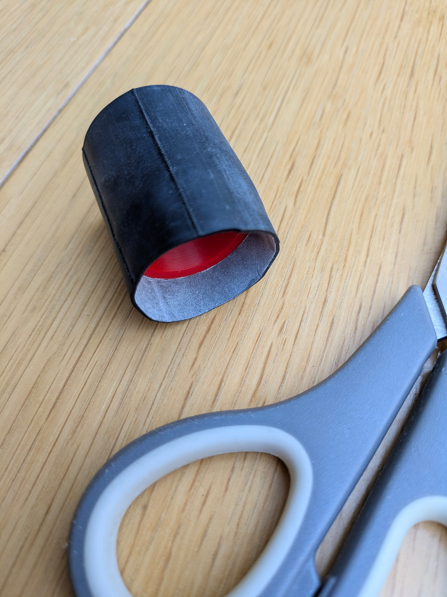
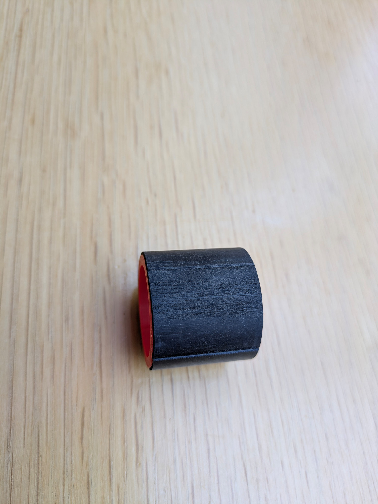
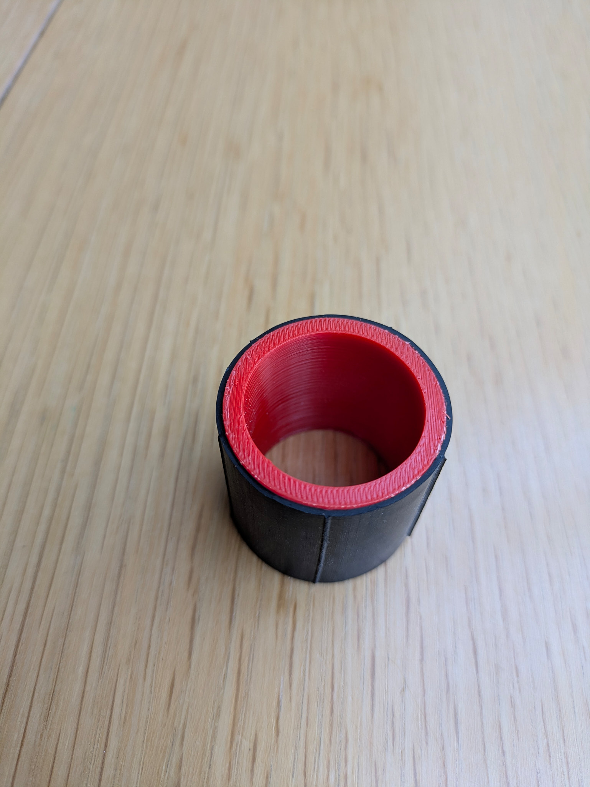
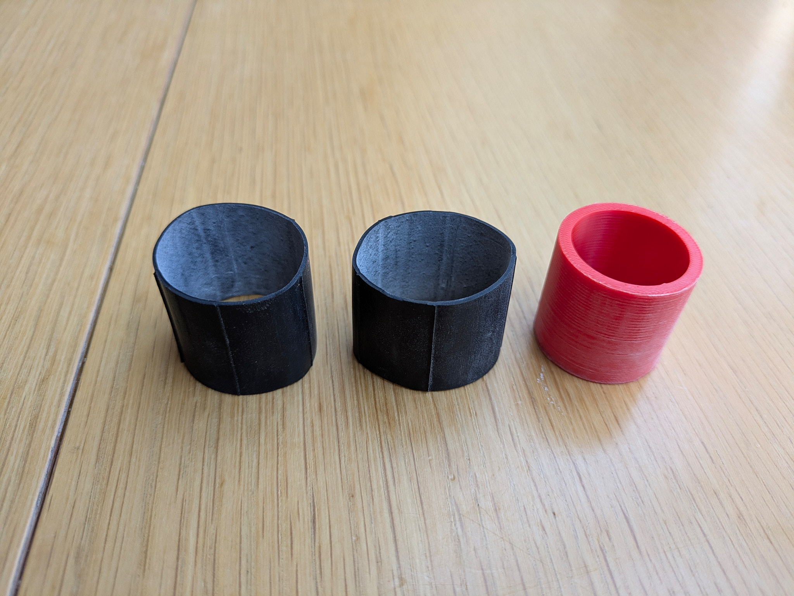
 
Tube installer: After installing one set and fighting with the tube I created a quicker way to get the tube on the rum without skinning your knuckles. If you are good with a sharp object you can reuse the zipties across a couple of tubes by releasing them. I could get 4 rims done off a set of 4 on average. If you want to get it done quickly simply snip the cable ties once the rubber is on the rim.
 
Install the first two zipties - notice the orientation of the ziptie to assist with stretching.
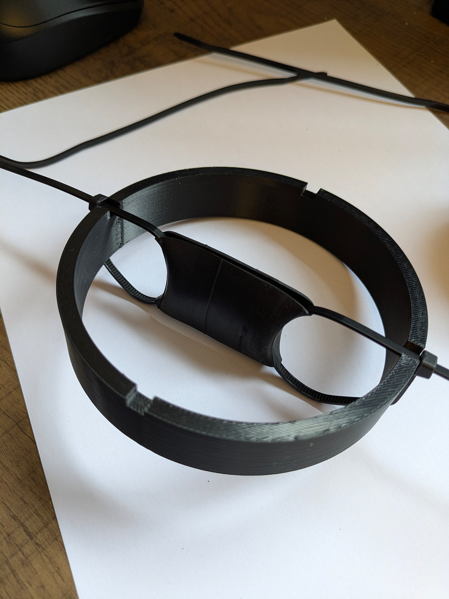
 
Add the next two zipties
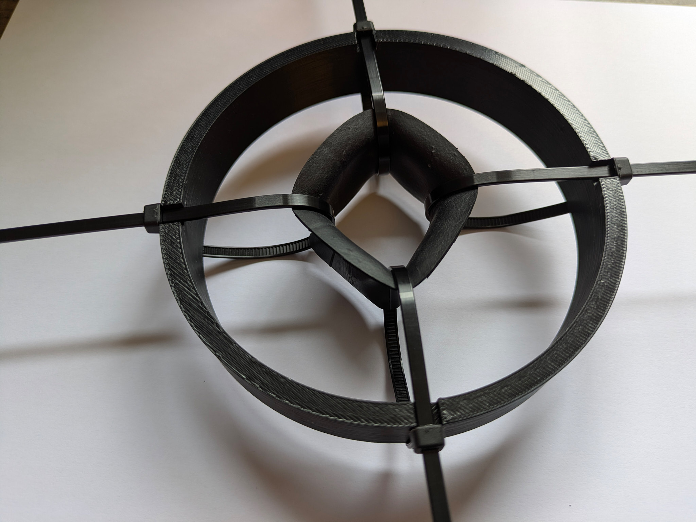
 
Slowly stretch to size - use the roller as a guide if you need to. You can get away with slightly smaller then the rim and simply push it over the edge.
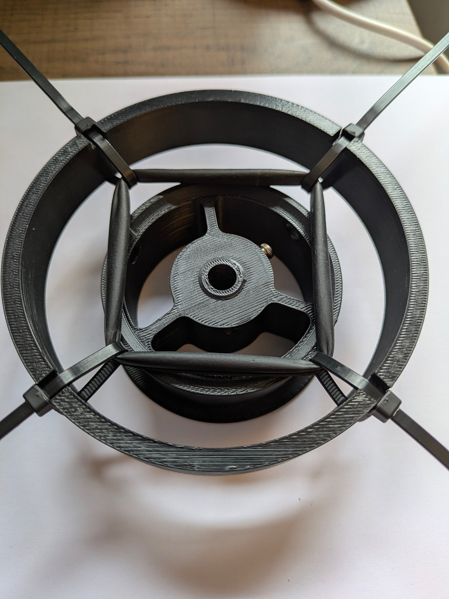
 
Slip it on the roller
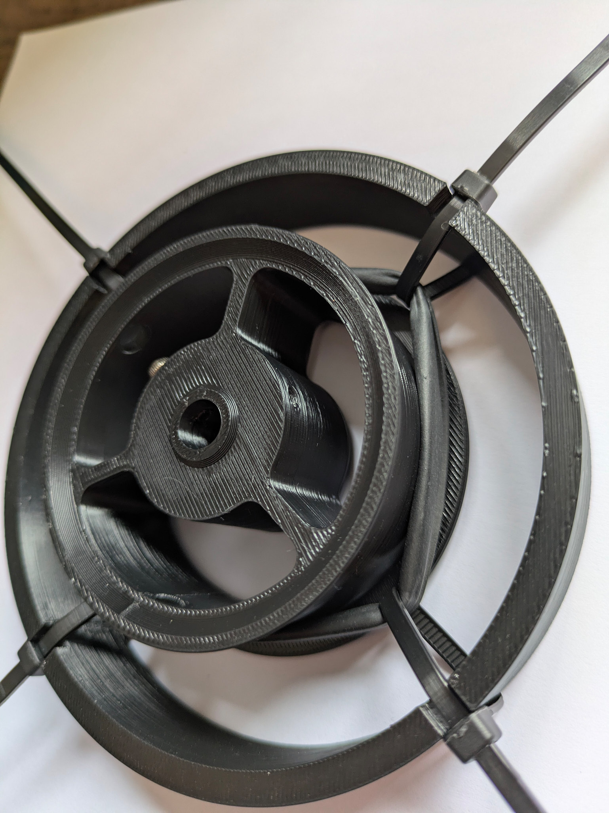
 
Either use a sharp object (carefully) to unlock the ziptie and undo or use a pair of snips and cut them
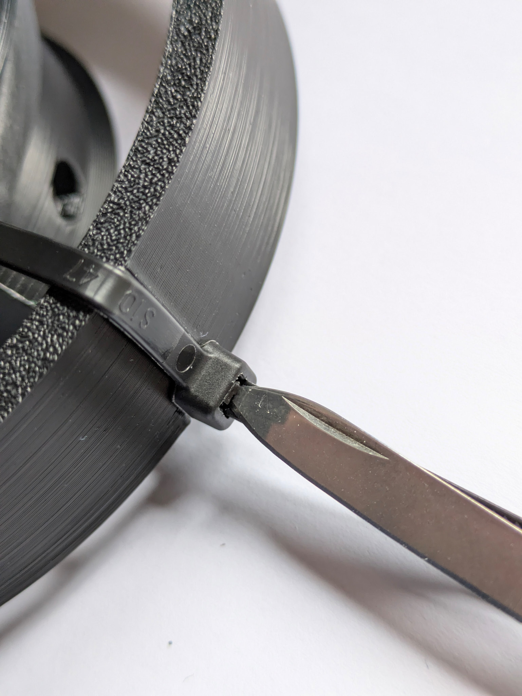
 
Slowly pull the zipies from under the tube. Careful not to split/cut the tube at this stage
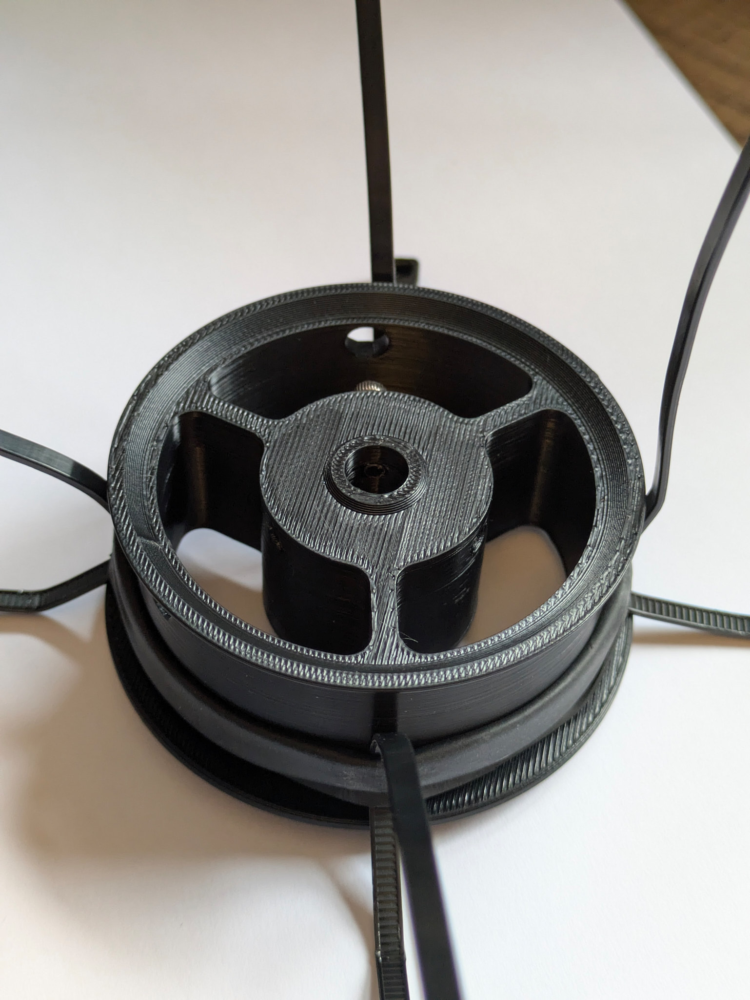
 
Rolled rubber on the roller.
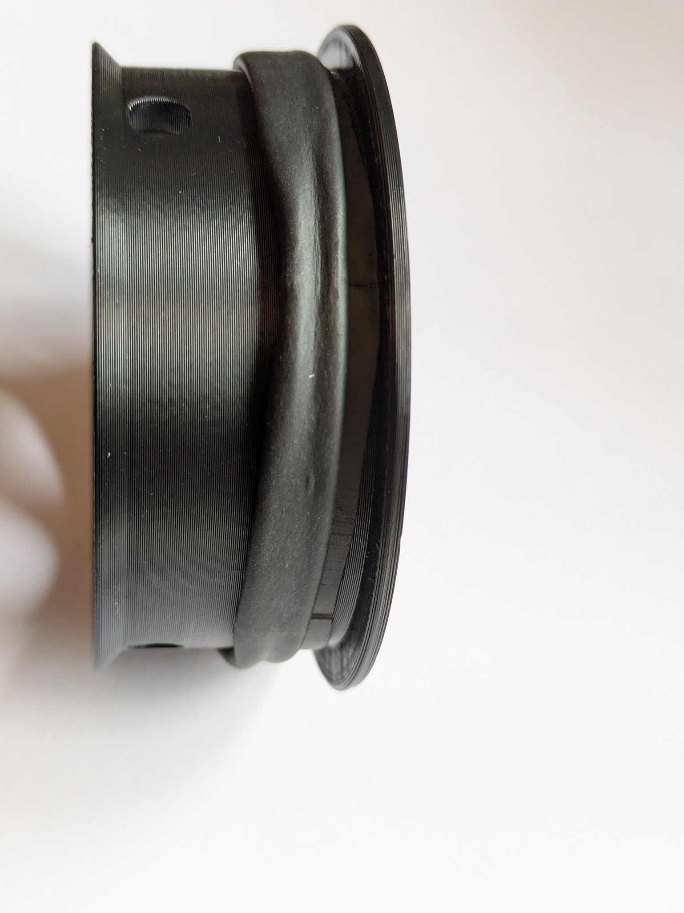
 
Unroll the rubber and shift around to cover the roller.
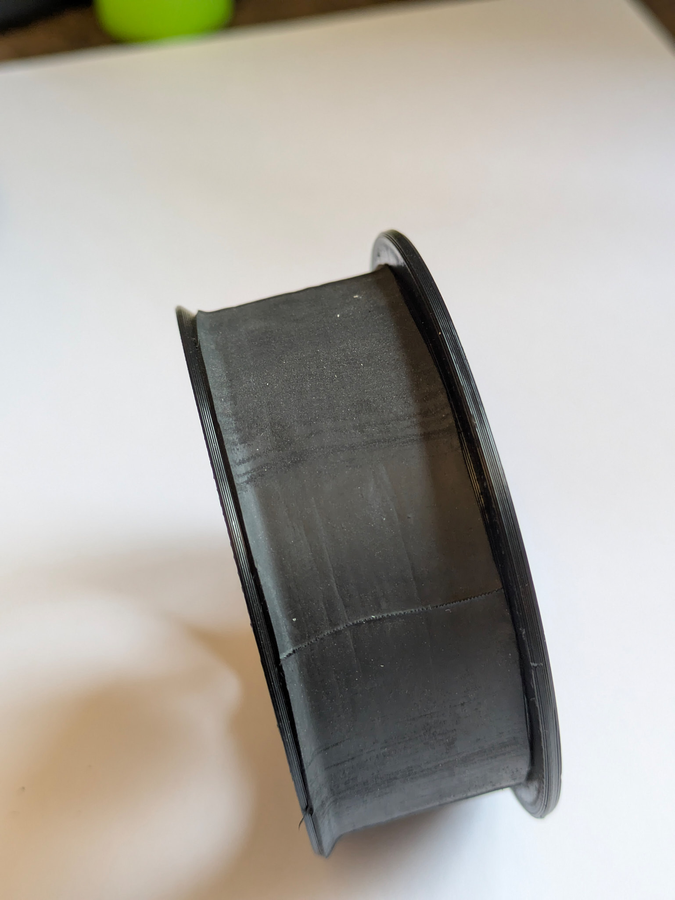

All done - now assemble onto your EMU! 

