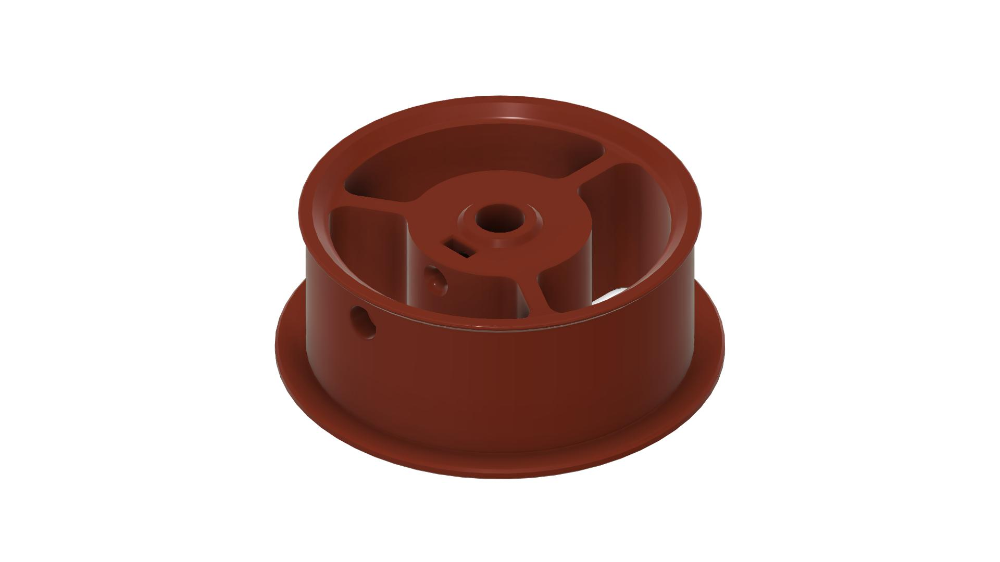
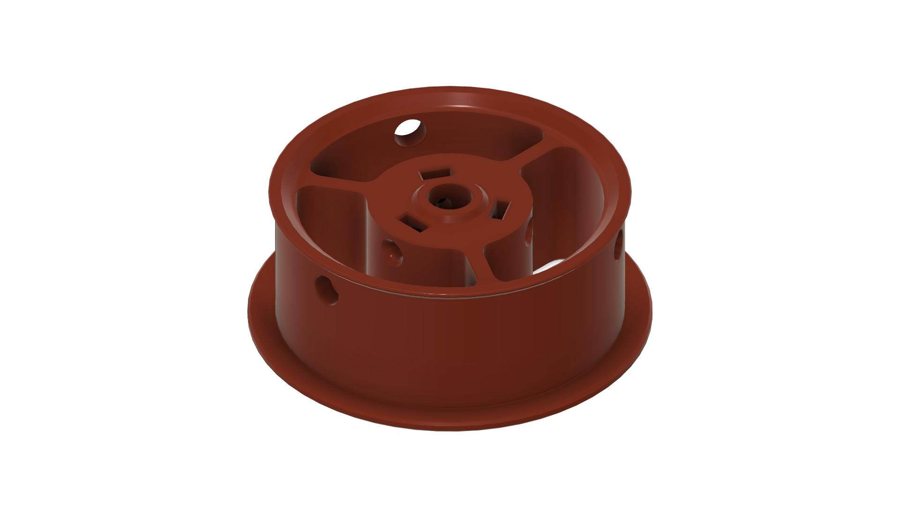

# Rim roller with square nuts

A remix to use square nuts to secure the rim rollers instead of screwing directly into the plastic.

> The 1 hole version has been adopted and now resides in `STL/Filamentalist` folder.

| 1 Hole | 3 Holes |
|---|---|
|  |  |

## Credits
- Original mod by [martijnvanduijneveldt](https://github.com/martijnvanduijneveldt)
- Improved by [DW Tas](https://github.com/DW-Tas)